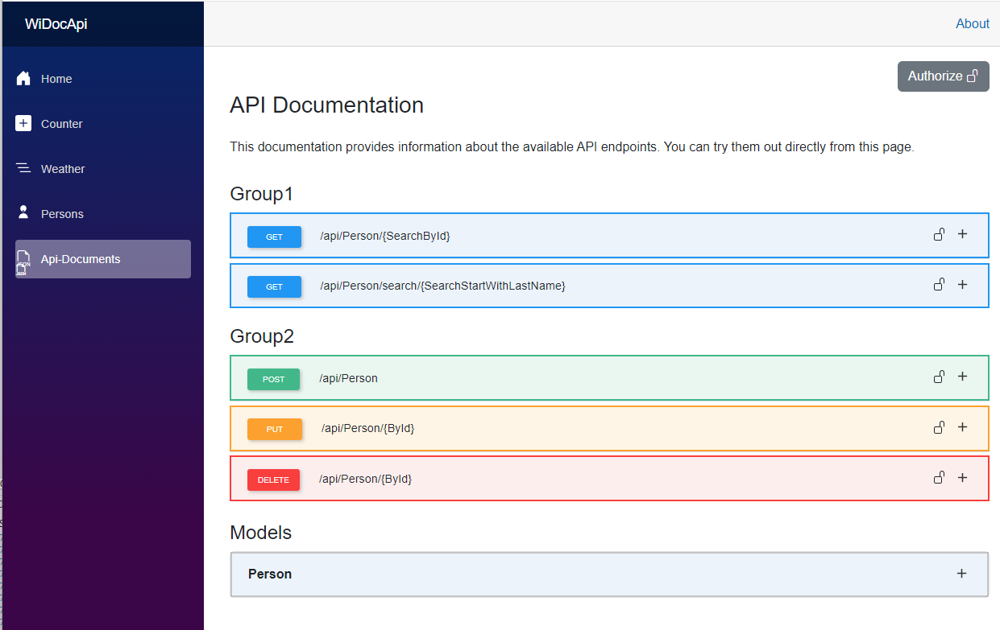
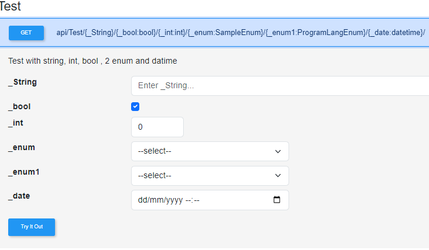

# WiDocApi
> ### This version now includes specific examples of both `ApiEndpoints.json` and `appsettings.json` to give users clear instructions on how to configure and use the API settings.
### This updated version includes the mention of the **WiDocApi_test** project, which provides an example of how to integrate the WiDocApi library into a Blazor app.
**WiDocApi** is a Blazor .NET 8 program built as a Razor Class Library that provides a Swagger-like interface for API documentation and interaction. The project supports API key integration and manages API calls through a JSON configuration file in the `Endpoints` directory of the main Blazor application.

## Features

- **Swagger-like Interface**: WiDocApi offers an easy-to-use interface for exploring and testing API endpoints.
- **API Key Integration**: API calls are secured using an API key stored in the `appsettings.json` file.
- **Single Razor Component Page**: The interface is rendered as a single Razor component, making it easy to integrate.
- **JSON-Based API Configuration**: API calls are defined in an `apisettings.json` file, enabling easy management of endpoints.


> #### download the WiDocApi library from my GitHub https://github.com/wvillevoye/WiDocApi/pkgs/nuget/WiDocApi_blazor

## Create Endpoints in your blazor project:


>  In the sample Blazor site, I have connected a database (persons). From this database, I have created an Endpoints directory with several endpoints for GET, POST, PUT, and DELETE operations. The same API key functionality can be used for these endpoints as well. See the example for more details.

 **group.AddEndpointFilter<WiDocApi_Blazor.WiDocApi.Helpers.ApiKeyAuthFilter>();**


```csharp
public static void PersonsEndpoints(this IEndpointRouteBuilder endpoints, IConfiguration configuration)
      {
            var group = endpoints.MapGroup("/api").WithTags("GetPerson");
            if (!string.IsNullOrEmpty(configuration["ApiSettings:ValidApiKey"]))
            {
                group.AddEndpointFilter<WiDocApi_Blazor.WiDocApi.Helpers.ApiKeyAuthFilter>();
            }
            group.MapGet
            etc...
           
```
## New in version 2.0.0
## Using your own endpoints in your Blazor App?:
- For version 2.0.0 it is possible to specify the type for the endpoints, for example :int :bool :enum :datatime
see an example below
- it is possible to download your endpoints result.
- it is to use the enum in the endpoint you must add the EnumUtils class to your project in my example:

### Create in your blazor a new component and add the following code:
```csharp
 
    group.MapGet("/Test/{_String}/{_bool:bool}/{_int:int}/{_enum:SampleEnum}/{_enum1:ProgramLangEnum}/{_date:datetime}/",
      (string _String, bool _bool, int _int, SampleEnum _enum, ProgramLangEnum _enum1, DateTime _date) =>
        {
           var _res = new Dictionary<string, object>
             {
               {"String", _String},
               {"bool", _bool.ToString()},
               {"int", _int.ToString()},
               {"date", _date.ToString("yyyy-MM-dd HH:mm:ss")}, // Ensuring proper date format
               {"enum", _enum.ToString()},
                {"enum1", _enum1.ToString()}
             };

               return Results.Json(_res, new JsonSerializerOptions { WriteIndented = true });
         })
         .WithName("Test123")
         .WithOpenApi()
         .AddWiDocApiEndpoints(new EndpointInfo
           {
               Group = "Test",
               Description = "Test with string, int, bool , 2 enum and datime",
               CacheDurationMinutes = 0,
               EnumLists = EnumUtils.CreateEnumLists(
                            ("_enum", typeof(SampleEnum)),
                            ("_enum1", typeof(ProgramLangEnum))
                           )
           });


 public enum SampleEnum
        {
            Option1,
            Option2,
            Option3
        }

        public enum ProgramLangEnum
        {
            cobol,
            python,
            csharp
        }
 ```

 


 if you want to use the enum in the endpoint you must add the EnumUtils class to your project in my example:
 ```csharp
 builder.Services.AddRouting(options =>
{
    options.ConstraintMap.Add("sampleEnum", typeof(EnumRouteConstraint<SampleEnum>));
    options.ConstraintMap.Add("ProgramLangEnum", typeof(EnumRouteConstraint<ProgramLangEnum>));
});

 ```
 ## how to use this Blazor package:
 ```csharp
@page "/apidocs"
@rendermode InteractiveServer
<WiDocApi_Blazor.Apidocs T="@object" classModels="@modelList" jsonFilePath="@filePath" />

@code {
    private List<object> modelList = new();
    private string filePath = "ApiEndpoints.json";
    protected override void OnInitialized()
    {
        // Initialize your models and add them to the list
        modelList.Add(new Models.Person());
        
    }
}
```
 **add this js script in your App.razor**  
 _content/WiDocApi_Blazor/WiDocApiScript.js (this is for the download fun))
 ```csharp
 <body>
    <Routes />
    <script src="_framework/blazor.web.js"></script>
    <script src="_content/WiDocApi_Blazor/WiDocApiScript.js"></script>
    <script src="https://cdn.jsdelivr.net/npm/bootstrap@5.3.2/dist/js/bootstrap.bundle.min.js" integrity="sha384-C6RzsynM9kWDrMNeT87bh95OGNyZPhcTNXj1NW7RuBCsyN/o0jlpcV8Qyq46cDfL" crossorigin="anonymous"></script>
</body>

````


The endpoint class look like this:
```csharp
 public class EndpointInfo
    {
        public int Id { get; set; }
        public string Group { get; set; } = string.Empty;
        public string Description { get; set; } = string.Empty;
        public bool RequiresInput { get; set; } = true;
        [Range(0, int.MaxValue, ErrorMessage = "Cache duration must be a non-negative value.")]
        public int CacheDurationMinutes { get; set; } = 0;
        public bool Active { get; set; } = true;
    }
```

**other use this:**
### Example of `ApiEndpoints.json`

Below is an example of how the API endpoints are configured in the `ApiEndpoints.json` file. Each entry includes information about the endpoint, such as its method, path, description, and caching behavior:

- Store this file under your `wwwroot` directory.
- The baseUrl property determines the base URL for API calls. It checks if a value is provided in the appsettings.json configuration file under "ApiSettings:BaseUrl". If the configuration is empty or missing, it defaults to the current base URI of the application, removing any trailing slashes.

```json
[
  {
    "Id": 1,
    "BaseUrl": null,
    "Group": "Group1",
    "Path": "/api/Person/{SearchById}",
    "Description": "Returns information about the person specified by Id.",
    "httpMethod": "GET",
    "RequiresInput": true,
    "CacheDurationMinutes": 10
  },
  {
    "Id": 2,
    "BaseUrl": null,
    "Group": "Group1",
    "Path": "/api/Person/search/{SearchStartWithLastName}",
    "Description": "Returns a list of persons starting with the specified last name.",
    "httpMethod": "GET",
    "RequiresInput": true,
    "CacheDurationMinutes": 10
  },
  {
    "Id": 3,
    "BaseUrl": null,
    "Group": "Group2",
    "Path": "/api/Person",
    "Description": "Adds a new person.",
    "httpMethod": "POST",
    "RequiresInput": false,
    "CacheDurationMinutes": 0
  },
  {
    "Id": 4,
    "BaseUrl": null,
    "Group": "Group2",
    "Path": "/api/Person/{ById}",
    "Description": "Updates a person's information.",
    "httpMethod": "PUT",
    "RequiresInput": true
  },
  {
    "Id": 5,
    "BaseUrl": null,
    "Group": "Group2",
    "Path": "/api/Person/{ById}",
    "Description": "Deletes a person.",
    "httpMethod": "DELETE",
    "RequiresInput": true
  }
]
```
## The appsettings.json file
The appsettings.json file is used to store the API key for the application. The API key is stored under the "ApiSettings:ValidApiKey" key. The key is used to validate API calls made to the application.

**If no ApiSettings value is provided, the authorize button will not be visible.**
```json
{
  "ApiSettings": {
    "ValidApiKey": "test"
  }
}
```
## WiDocApiSchemaAttribute 
The WiDocApiSchemaAttribute is a custom attribute that can be applied to class properties. It allows you to provide a description for each property, which can be used in API documentation or other contexts where property metadata is needed.

```csharp
[AttributeUsage(AttributeTargets.Property, Inherited = false, AllowMultiple = false)]
public sealed class WiDocApiSchemaAttribute : Attribute
{
    public string Description { get; }

    public WiDocApiSchemaAttribute(string description)
    {
        Description = description;
    }
}
```
- Usage: The attribute is applied to properties to provide a description, which is stored in the Description property.
- Parameters: The constructor takes a string description parameter that specifies the description for the annotated property.

 Constraints:
- The attribute can only be used on properties (AttributeTargets.Property).
- It cannot be inherited or applied multiple times on the same property (Inherited = false, AllowMultiple = false).

 This attribute helps document class properties for use in APIs or UI components.

  **WiDocApiSchemaAttribute Example**
```csharp
  public partial class Person
{
    [Key]
    [WiDocApiSchema("Person ID for this person")]
    public int PersonID { get; set; }

    [StringLength(50)]
    [WiDocApiSchema("First name of the person")]
    public string FirstName { get; set; }
    etc...
```
