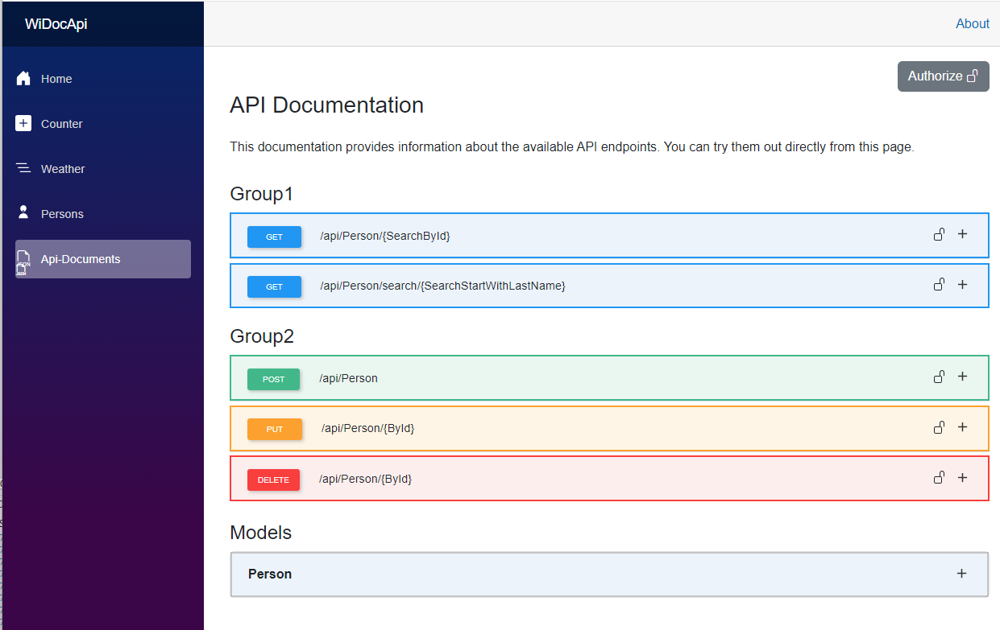


# widocapi_blazor

## Overview
`widocapi_blazor` is a Razor Class Library (RCL) built with Blazor and targeting .NET 8. This library provides a set of reusable Blazor components designed to simplify the development of modern, responsive web applications. The components in `widocapi_blazor` are designed to be easily integrated into any Blazor project, providing a consistent and efficient way to build user interfaces.

## Features
- **Reusable Components**: A collection of pre-built Blazor components that can be easily integrated into your projects.
- **Responsive Design**: Components are designed to be responsive and work well on various screen sizes.
- **Easy Integration**: Simple to add to any Blazor project with minimal setup.
- **Extensible**: Easily extend or customize the components to fit your specific needs.
- **Swagger-like Interface**: WiDocApi offers an easy-to-use interface for exploring and testing API endpoints.
- **API Key Integration**: API calls are secured using an API key stored in the `appsettings.json` file.
- **Single Razor Component Page**: The interface is rendered as a single Razor component, making it easy to integrate.
- **JSON-Based API Configuration**: API calls are defined in an `apisettings.json` file, enabling easy management of endpoints.


## Create Endpoints in your blazor project:


>  In the sample Blazor site, I have connected a database (persons). From this database, I have created an Endpoints directory with several endpoints for GET, POST, PUT, and DELETE operations. The same API key functionality can be used for these endpoints as well. See the example for more details.

 **group.AddEndpointFilter<WiDocApi_Blazor.WiDocApi.Helpers.ApiKeyAuthFilter>();**


```csharp
public static void PersonsEndpoints(this IEndpointRouteBuilder endpoints, IConfiguration configuration)
      {
            var group = endpoints.MapGroup("/api").WithTags("GetPerson");
            if (!string.IsNullOrEmpty(configuration["ApiSettings:ValidApiKey"]))
            {
                group.AddEndpointFilter<WiDocApi_Blazor.WiDocApi.Helpers.ApiKeyAuthFilter>();
            }
            group.MapGet("/Person/{SearchById}", async (int SearchById, SamplePersonsContext dbContext) =>
            {
                var _person = await dbContext.Persons.SingleOrDefaultAsync(x=>x.PersonID.Equals(SearchById));
                if (_person == null)
                {
                    return Results.NotFound("Person not found.");
                }
                return Results.Ok(_person);
            }).WithName("SearchById").WithOpenApi();
            etc...
           
```


### Create in your blazor a new component and add the following code:


```razor
@page "/apidocs"
@rendermode InteractiveServer
<WiDocApi_Blazor.Apidocs T="@object" classModels="@modelList" jsonFilePath="@filePath" />

@code {
    private List<object> modelList = new();
    private string filePath = "ApiEndpoints.json";
    protected override void OnInitialized()
    {
        // Initialize your models and add them to the list
        modelList.Add(new Models.Person());
        
    }
}
```
## Using your own endpoints in your Blazor App?:
**Then you can use this:** .AddWiDocApiEndpoints
```csharp
  
 group.MapGet("/Person/search/{SearchStartWithLastName}/{city}", async (string SearchStartWithLastName, string city, SamplePersonsContext dbContext) =>
      {
       var _persons = await dbContext.Persons.Where(x => x.LastName.ToLower().StartsWith(SearchStartWithLastName.ToLower())).ToListAsync();

         if (_persons == null)
          {
              return Results.NotFound("Persons not found.");
          }
          return Results.Ok(_persons);
        }).WithName("SearchStartWithLastName")
          .WithOpenApi()
          .AddWiDocApiEndpoints(new EndpointInfo
             {
                 Group = "GetPerson",
                 Description = "Search person by last name starting with",
                 CacheDurationMinutes = 10,
             });
           
```
The endpoint class look like this:
```csharp
 public class EndpointInfo
    {
        public int Id { get; set; }
        public string Group { get; set; } = string.Empty;
        public string Description { get; set; } = string.Empty;
        public bool RequiresInput { get; set; } = true;
        [Range(0, int.MaxValue, ErrorMessage = "Cache duration must be a non-negative value.")]
        public int CacheDurationMinutes { get; set; } = 0;
        public bool Active { get; set; } = true;
    }
```

**other use this:**
### Example of `ApiEndpoints.json`

Below is an example of how the API endpoints are configured in the `ApiEndpoints.json` file. Each entry includes information about the endpoint, such as its method, path, description, and caching behavior:

- Store this file under your `wwwroot` directory.
- The baseUrl property determines the base URL for API calls. It checks if a value is provided in the appsettings.json configuration file under "ApiSettings:BaseUrl". If the configuration is empty or missing, it defaults to the current base URI of the application, removing any trailing slashes.

```json
[
  {
    "Id": 1,
    "BaseUrl": null,
    "Group": "Group1",
    "Path": "/api/Person/{SearchById}",
    "Description": "Returns information about the person specified by Id.",
    "httpMethod": "GET",
    "RequiresInput": true,
    "CacheDurationMinutes": 10
  },
  {
    "Id": 2,
    "BaseUrl": null,
    "Group": "Group1",
    "Path": "/api/Person/search/{SearchStartWithLastName}",
    "Description": "Returns a list of persons starting with the specified last name.",
    "httpMethod": "GET",
    "RequiresInput": true,
    "CacheDurationMinutes": 10
  },
  {
    "Id": 3,
    "BaseUrl": null,
    "Group": "Group2",
    "Path": "/api/Person",
    "Description": "Adds a new person.",
    "httpMethod": "POST",
    "RequiresInput": false,
    "CacheDurationMinutes": 0
  },
  {
    "Id": 4,
    "BaseUrl": null,
    "Group": "Group2",
    "Path": "/api/Person/{ById}",
    "Description": "Updates a person's information.",
    "httpMethod": "PUT",
    "RequiresInput": true
  },
  {
    "Id": 5,
    "BaseUrl": null,
    "Group": "Group2",
    "Path": "/api/Person/{ById}",
    "Description": "Deletes a person.",
    "httpMethod": "DELETE",
    "RequiresInput": true
  }
]
```
## The appsettings.json file
The appsettings.json file is used to store the API key for the application. The API key is stored under the "ApiSettings:ValidApiKey" key. The key is used to validate API calls made to the application.

**If no ApiSettings value is provided, the authorize button will not be visible.**
```json
{
  "ApiSettings": {
    "ValidApiKey": "test"
  }
}
```
## WiDocApiSchemaAttribute 
The WiDocApiSchemaAttribute is a custom attribute that can be applied to class properties. It allows you to provide a description for each property, which can be used in API documentation or other contexts where property metadata is needed.

```csharp
[AttributeUsage(AttributeTargets.Property, Inherited = false, AllowMultiple = false)]
public sealed class WiDocApiSchemaAttribute : Attribute
{
    public string Description { get; }

    public WiDocApiSchemaAttribute(string description)
    {
        Description = description;
    }
}
```
- Usage: The attribute is applied to properties to provide a description, which is stored in the Description property.
- Parameters: The constructor takes a string description parameter that specifies the description for the annotated property.

 Constraints:
- The attribute can only be used on properties (AttributeTargets.Property).
- It cannot be inherited or applied multiple times on the same property (Inherited = false, AllowMultiple = false).

 This attribute helps document class properties for use in APIs or UI components.

  **WiDocApiSchemaAttribute Example**
```csharp
  public partial class Person
{
    [Key]
    [WiDocApiSchema("Person ID for this person")]
    public int PersonID { get; set; }

    [StringLength(50)]
    [WiDocApiSchema("First name of the person")]
    public string FirstName { get; set; }
    etc...
```


