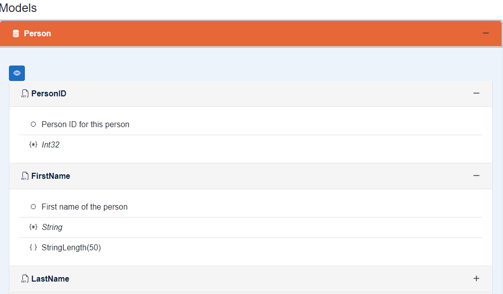

# WiDocApi
> ### This version now includes specific examples of both `ApiEndpoints.json` and `appsettings.json` to give users clear instructions on how to configure and use the API settings.
### This updated version includes the mention of the **WiDocApi_test** project, which provides an example of how to integrate the WiDocApi library into a Blazor app.
**WiDocApi** is a Blazor .NET 8 program built as a Razor Class Library that provides a Swagger-like interface for API documentation and interaction. The project supports API key integration and manages API calls through a JSON configuration file in the `Endpoints` directory of the main Blazor application.

## Features

- **Swagger-like Interface**: WiDocApi offers an easy-to-use interface for exploring and testing API endpoints.
- **API Key Integration**: API calls are secured using an API key stored in the `appsettings.json` file.
- **Single Razor Component Page**: The interface is rendered as a single Razor component, making it easy to integrate.
- **JSON-Based API Configuration**: API calls are defined in an `apisettings.json` file, enabling easy management of endpoints.


To create a new Blazor project with the WiDocApi library, follow these steps:
- Create a new Blazor Web App project.
- Framework: .NET 8.0
- Authentication: None Authentication
- Configure for HTTPS: Yes
- interacrive render mode: Server
- Interactivity locaction: Per page/Component
- Include sample pages: (optional)


> #### download the WiDocApi library from my GitHub https://github.com/wvillevoye/WiDocApi/pkgs/nuget/WiDocApi_blazor

## Create Endpoints in your blazor project:


>  In the sample Blazor site, I have connected a database (persons). From this database, I have created an Endpoints directory with several endpoints for GET, POST, PUT, and DELETE operations. The same API key functionality can be used for these endpoints as well. See the example for more details.

 **group.AddEndpointFilter<WiDocApi_Blazor.WiDocApi.Helpers.ApiKeyAuthFilter>();**


```csharp
public static void PersonsEndpoints(this IEndpointRouteBuilder endpoints, IConfiguration configuration)
      {
            var group = endpoints.MapGroup("/api").WithTags("GetPerson");
            if (!string.IsNullOrEmpty(configuration["ApiSettings:ValidApiKey"]))
            {
                group.AddEndpointFilter<WiDocApi_Blazor.WiDocApi.Helpers.ApiKeyAuthFilter>();
            }
            group.MapGet
            etc...
           
```
## New in version 2.0.0
## Using your own endpoints in your Blazor App?:
- For version 2.0.0 it is possible to specify the type for the endpoints, for example :int :bool :select :datatime
see an example below
- it is possible to download your endpoints result.
- it is to use the enum in the endpoint you must add the EnumUtils class to your project Please note that with Name:enum the enum must always be named, for example Cars:CarsEnum:

### Create in your blazor a new component and add the following code:
```csharp
  group.MapGet("/Person/Test/{SampleString}/{SampleBool:bool}/{SampleInt:int}/{SampleList:select}/{SampleList1:select}/{SampleDate:datetime}/{StatesList:select}",
                (string SampleString, bool SampleBool, int SampleInt, SampleEnum SampleList, ProgramLangEnum SampleList1, DateTime SampleDate, string StatesList) =>
                {
                    var _res = new Dictionary<string, object>
                    {
                            {"String", SampleString},
                            {"bool", SampleBool.ToString()},
                            {"int", SampleInt.ToString()},
                            {"date", SampleDate.ToString("yyyy-MM-dd HH:mm:ss")}, // Ensuring proper date format
                            {"enum", SampleList.ToString()},
                            {"enum1", SampleList1.ToString()},
                            {"state", StatesList.ToString()}
                    };

                    return Results.Json(_res, new JsonSerializerOptions { WriteIndented = true });
                })
                .WithName("Test123")
                .WithOpenApi()
                .AddWiDocApiEndpoints(new EndpointInfo
                {
                    Group = "Test",
                    Description = "Test with string, int, bool, 2 enum, and datetime",
                    CacheDurationMinutes = 0,
                    SelectLists = WiDoApiUtils.CreateSelectInput("SampleList",WiDoApiUtils.SelectValueType.Text, WiDoApiUtils.EnumToDictionary<SampleEnum>()["SampleEnum"])
                                         .AddWithChain("SampleList1", WiDoApiUtils.SelectValueType.Text, WiDoApiUtils.EnumToDictionary<ProgramLangEnum>()["ProgramLangEnum"])
                                         .AddWithChain("StatesList", WiDoApiUtils.SelectValueType.Text, states)
                });
 ```

 

 ## Route Configuration Example
 ```csharp
 group.MapGet("/Person/Test/{SampleString}/{SampleBool:bool}/{SampleInt:int}/{SampleList:select}/{SampleList1:select}/{SampleDate:datetime}/{StatesList:select}", 
        (string SampleString, bool SampleBool, int SampleInt, string SampleList, string SampleList1, DateTime SampleDate, string StatesList) =>
{
    // Your logic here
});

 ````
 This endpoint accepts several parameters of different types and enforces specific type constraints on them, making it easier to handle requests while ensuring that the incoming data conforms to the expected formats.

**Route Parameters Explanation**
- **SampleString**: A plain string value passed in the route.
- **SampleBool:bool**: A boolean value (true or false). The :bool constraint ensures that only valid boolean values are accepted in the URL.
- **SampleInt:int**: An integer value. The :int constraint ensures that only whole numbers are allowed.
- **SampleList:select** and {SampleList1:select}: These represent custom types or lists, likely constrained to specific values (e.g., enum-like data or predefined options). You would handle them as string types in this context, but the select constraint enforces a selection from valid options.
- **SampleDate:datetime**: A DateTime object. The :datetime constraint ensures that only valid date and time formats are accepted.

**Benefits of Route Constraints**
By using route constraints like :bool, :int, and :datetime, we ensure that the incoming data follows the required formats, reducing potential errors and simplifying request validation. The use of select constraints, which could be custom validators for specific options, allows for clean and controlled input handling, especially for parameters like lists and enums.

```csharp
.AddWiDocApiEndpoints(new EndpointInfo
{
    Group = "Test",
    Description = "Test with string, int, bool, 2 enums, and datetime",
    CacheDurationMinutes = 0,
    SelectLists = WiDoApiUtils.CreateSelectInput("SampleList", WiDoApiUtils.SelectValueType.Text, WiDoApiUtils.EnumToDictionary<SampleEnum>()["SampleEnum"])
                    .AddWithChain("SampleList1", WiDoApiUtils.SelectValueType.Text, WiDoApiUtils.EnumToDictionary<ProgramLangEnum>()["ProgramLangEnum"])
                    .AddWithChain("StatesList", WiDoApiUtils.SelectValueType.Text, states)
});
```
- Group: "Test" This specifies the group under which the endpoint falls. In this case, it is labeled as Test. Grouping helps organize endpoints logically.
- Description: "Test with string, int, bool, 2 enum, and datetime" A brief description of the endpoint's functionality, indicating the parameter types it will handle.
- CacheDurationMinutes: 0 The duration (in minutes) for which the results are cached. Setting this to 0 disables caching for the endpoint.
- SelectLists: This section defines select list inputs (dropdown options) for the endpoint's parameters. The WiDoApiUtils.CreateSelectInput method is used to initialize the select list, and .AddWithChain is used to add additional select lists.
- - "SampleList": The first select input corresponds to SampleEnum. The WiDoApiUtils.EnumToDictionary<SampleEnum>()["SampleEnum"] is used to convert the enum to a dictionary, providing options for the dropdown.
- - "SampleList1": A chained select input for ProgramLangEnum. Similarly, it converts the enum into a dictionary of options.
- - "StatesList": Another select input for a list of states. The states parameter represents a predefined list of state values available for selection.
 
 ## how to use this Blazor package:
 ```csharp
@page "/apidocs"
@rendermode InteractiveServer
<WiDocApi_Blazor.Apidocs T="@object" classModels="@modelList" />

@code {
    private List<object> modelList = new();
    private string filePath = "ApiEndpoints.json";
    protected override void OnInitialized()
    {
        // Initialize your models and add them to the list
        modelList.Add(new Models.Person());
        
    }
}
```
 **add this js script in your App.razor**  
 _content/WiDocApi_Blazor/WiDocApiScript.js (this is for the download fun))
 ```csharp
 <body>
    <Routes />
    <script src="_framework/blazor.web.js"></script>
    <script src="_content/WiDocApi_Blazor/WiDocApiScript.js"></script>
    <script src="https://cdn.jsdelivr.net/npm/bootstrap@5.3.2/dist/js/bootstrap.bundle.min.js" integrity="sha384-C6RzsynM9kWDrMNeT87bh95OGNyZPhcTNXj1NW7RuBCsyN/o0jlpcV8Qyq46cDfL" crossorigin="anonymous"></script>
</body>

````


The endpoint class look like this:
```csharp
     public class EndpointInfo
    {
        public int Id { get; set; }
        public string Group { get; set; } = string.Empty;
        public string Description { get; set; } = string.Empty;
        public bool RequiresInput { get; set; } = true;
        [Range(0, int.MaxValue, ErrorMessage = "Cache duration must be a non-negative value.")]
        public int CacheDurationMinutes { get; set; } = 0;
        public Dictionary<string, Dictionary<string, string>> SelectLists { get; set; } = [];
        public bool Active { get; set; } = true;

    }
```


## The appsettings.json file
The appsettings.json file is used to store the API key for the application. The API key is stored under the "ApiSettings:ValidApiKey" key. The key is used to validate API calls made to the application.

**If no ApiSettings value is provided, the authorize button will not be visible.**
```json
{
  "ApiSettings": {
    "ValidApiKey": "test"
  }
}
```
## WiDocApiSchemaAttribute 
The WiDocApiSchemaAttribute is a custom attribute that can be applied to class properties. It allows you to provide a description for each property, which can be used in API documentation or other contexts where property metadata is needed.

```csharp
[AttributeUsage(AttributeTargets.Property, Inherited = false, AllowMultiple = false)]
public sealed class WiDocApiSchemaAttribute : Attribute
{
    public string Description { get; }

    public WiDocApiSchemaAttribute(string description)
    {
        Description = description;
    }
}
```
- Usage: The attribute is applied to properties to provide a description, which is stored in the Description property.
- Parameters: The constructor takes a string description parameter that specifies the description for the annotated property.

 Constraints:
- The attribute can only be used on properties (AttributeTargets.Property).
- It cannot be inherited or applied multiple times on the same property (Inherited = false, AllowMultiple = false).

 This attribute helps document class properties for use in APIs or UI components.

  **WiDocApiSchemaAttribute Example**
```csharp
  public partial class Person
{
    [Key]
    [WiDocApiSchema("Person ID for this person")]
    public int PersonID { get; set; }

    [StringLength(50)]
    [WiDocApiSchema("First name of the person")]
    public string FirstName { get; set; }
    etc...
```
## Copy Result option to your own download folder
 

 ## Model chapter on WidocApi
 

### You can also click on the button (eye) and get a preview json that you can use for Post and put.
 
 